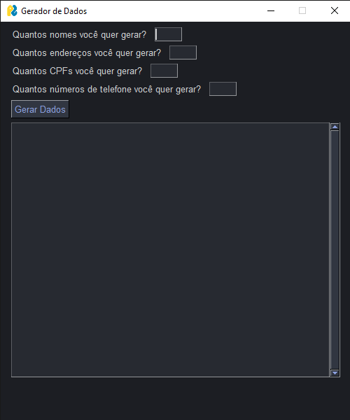

## Gerador de Dados com PySimpleGUI e Faker

Este projeto é uma aplicação GUI (Graphical User Interface) construída com PySimpleGUI para gerar dados fictícios, como nomes, endereços, CPFs e números de telefone, utilizando a biblioteca Faker. O objetivo é facilitar a geração de dados para testes ou outros usos que necessitem de dados falsos.



### Componentes Principais

1. **PySimpleGUI**: Biblioteca Python que simplifica a criação de interfaces gráficas.
2. **Faker**: Biblioteca para gerar dados fictícios realistas.

### Funcionalidades do Código

1. **Inicialização do Faker**: A biblioteca Faker é configurada para gerar dados em português brasileiro (`pt_BR`).

   ```python
   fake = Faker('pt_BR')
   ```

2. **Função `gerar_dados`**: Responsável por gerar os dados conforme as quantidades especificadas pelo usuário. Ela lê os valores inseridos pelo usuário nos campos de entrada e gera os dados correspondentes.

   ```python
   def gerar_dados(values):
       def get_input_value(key):
           value = values[key]
           return int(value) if value.isdigit() else 0

       qtd_nome = get_input_value('-NOME-')
       qtd_endereco = get_input_value('-ENDERECO-')
       qtd_cpf = get_input_value('-CPF-')
       qtd_numeros = get_input_value('-NUMEROS-')

       resultado = ""

       for _ in range(qtd_nome):
           nome_completo = fake.name()
           resultado += f"Nome gerado é: {nome_completo}\n\n"

       for _ in range(qtd_endereco):
           endereco = fake.address()
           resultado += f"Endereço gerado é: {endereco}\n\n"

       for _ in range(qtd_cpf):
           cpf = fake.cpf()
           resultado += f"CPF gerado é: {cpf}\n\n"

       for _ in range(qtd_numeros):
           numero = fake.phone_number()
           resultado += f"Numero gerado é: {numero}\n\n"

       return resultado
   ```

3. **Definição do Tema**: A interface gráfica utiliza o tema `DarkGrey13`.

   ```python
   sg.theme('DarkGrey13')
   ```

4. **Layout da Interface**: Define a disposição dos elementos da GUI, incluindo campos de entrada para o usuário especificar a quantidade de dados a serem gerados e um botão para iniciar a geração.

   ```python
   layout = [
       [sg.Text("Quantos nomes você quer gerar?"), sg.Input(key='-NOME-', size=(5,1))],
       [sg.Text("Quantos endereços você quer gerar?"), sg.Input(key='-ENDERECO-', size=(5,1))],
       [sg.Text("Quantos CPFs você quer gerar?"), sg.Input(key='-CPF-', size=(5,1))],
       [sg.Text("Quantos números de telefone você quer gerar?"), sg.Input(key='-NUMEROS-', size=(5,1))],
       [sg.Button('Gerar Dados')],
       [sg.Multiline(size=(60, 20), key='-OUTPUT-', font=("Helvetica", 12))]
   ]
   ```

5. **Criação e Execução da Janela**: A janela é criada e exibida em um loop, aguardando eventos, como cliques de botões e entradas de texto.

   ```python
   window = sg.Window("Gerador de Dados", layout, size=(500, 600))

   while True:
       event, values = window.read()
       if event == sg.WINDOW_CLOSED:
           break
       if event == 'Gerar Dados':
           resultado = gerar_dados(values)
           window['-OUTPUT-'].update(resultado)

   window.close()
   ```

### Como Usar

1. Execute o script Python.
2. Na interface, insira a quantidade de dados que deseja gerar para cada categoria (nomes, endereços, CPFs e números de telefone).
3. Clique no botão "Gerar Dados".
4. Os dados gerados aparecerão na área de texto na parte inferior da janela.

### Requisitos

- Python 3.x
- PySimpleGUI
- Faker

Para instalar as bibliotecas necessárias, execute:

```sh
pip install PySimpleGUI Faker
```

---

Este projeto é útil para desenvolvedores que precisam de dados fictícios para testes e desenvolvimento, proporcionando uma maneira rápida e fácil de gerar essas informações.
